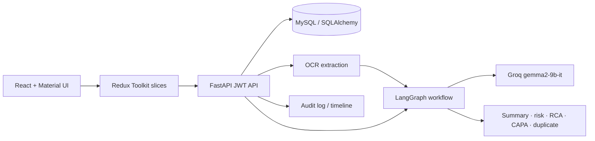
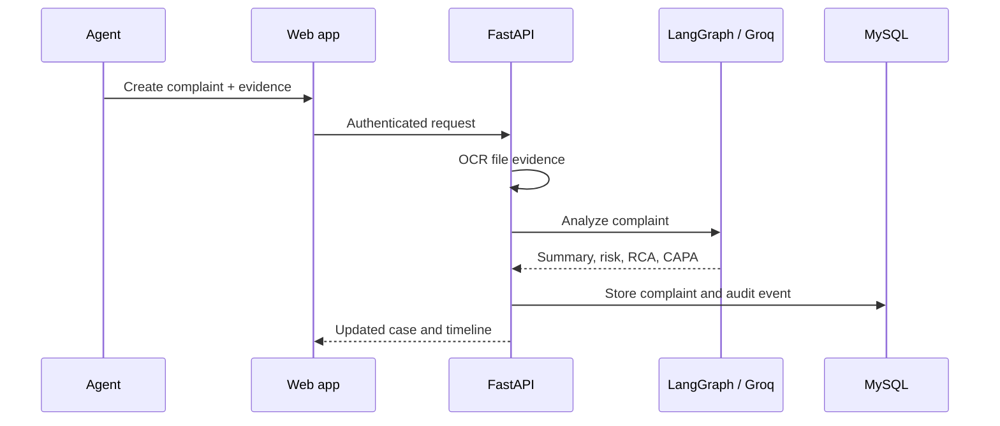

# AI Customer Complaint Management

Production-oriented complaint management system with React/Redux Toolkit/Material UI, FastAPI/SQLAlchemy/MySQL/JWT, and a LangGraph + Groq enrichment workflow.

## Start

1. Copy `.env.example` to `.env`, set secure database/JWT values, and optionally add `GROQ_API_KEY`.
2. Run `docker compose up --build`.
3. Open http://localhost:5173 and register the first account.

API documentation is at http://localhost:8000/docs. Uploaded evidence is stored under `uploads/` (mount durable storage in production).

## Architecture

- `backend/app/api`: HTTP controllers; `core`: settings/security; `models`: persistence; `schemas`: contracts; `services`: OCR and AI use cases.
- `frontend/src`: feature-oriented Redux slices, API client, pages and reusable components.

## Sample data and roles

On first startup, the API creates sample complaints and two development accounts: `admin@example.com` / `Admin123!` (admin) and `agent@example.com` / `Agent123!` (agent). Change/remove these seed credentials for production. Agents can create and update cases; only `admin` and `manager` roles can view the system audit feed or delete complaints.

## Production notes

Use a managed MySQL database, a secret manager for environment values, object storage/virus scanning for uploads, HTTPS, migrations (Alembic), rate limiting, and an authenticated reverse proxy. AI enrichment degrades to deterministic analysis when Groq credentials are absent.
